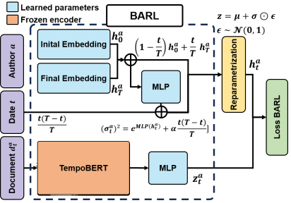

# Brownian Bridges for Author Representation Learning (BARL)

Official implementation of the paper *Building Brownian Bridges to Learn Dynamic Author Representations from Texts*

Enzo Terreau and Julien Velcin in

Symposium on Intelligent Data Analysis (IDA 2024)

## Model

## Requirements

- Python >= 3.7
- PyTorch >= 1.12.0
- transformers >= 4.30.0

## Data

All the data used in the paper come from the [Dynamic Author Representation model repository](https://github.com/edouardelasalles/dar)\[1\]. You will find here all the associated details of both s2g and nyt datasets.

## Execution 

To repoduce the experiments in the paper, you should first pretrain a BERT model on the time masking task for both datasets as explained in the paper [Time Masking for Temporal Language Models](https://arxiv.org/abs/2110.06366). You can use the associated repository [TempoBERT github](https://github.com/guyrosin/tempobert)\[2\].

You can then train BARL following the given command (you should replace the encoder by the pretrained TempoBERT instance) : 

`python run.py --dataset ./data/prediction/s2g --epochs 100 --encoder BERT --learningrate 5e-4`

## References
 \[1\] Delasalles, E., Lamprier, S., Denoyer, L.: Learning dynamic author representations with temporal language models. In: 2019 IEEE International Conference on Data Mining (ICDM). pp. 120–129. IEEE (2019)

 \[2\] Rosin, G.D., Guy, I., Radinsky, K.: Time masking for temporal language models. In: Proceedings of the Fifteenth ACM International Conference on Web Search and Data Mining. pp.833–841 (2022)
